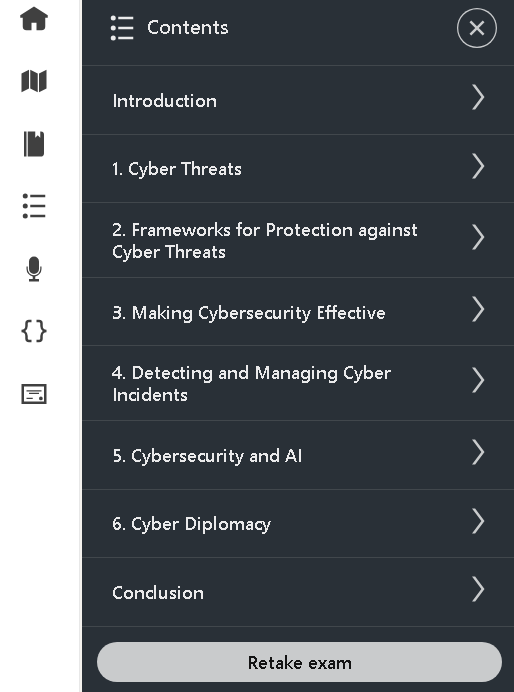

# 🛡️ Cybersecurity Foundations – LinkedIn Learning

This repository documents my study journey from the **Cybersecurity Foundations** course by [LinkedIn Learning](https://www.linkedin.com/learning/). It includes key concepts, hands-on demos, screenshots, and personal reflections to help learners understand the core principles of cybersecurity.

---

## 📜 Certificate

- 🎓 [Cybersecurity Foundations Certificate – LinkedIn Learning](./cert/CertificateOfCompletion_Cybersecurity%20Foundations.pdf)

---

## 🧠 Topics Covered

- 🔐 CIA Triad (Confidentiality, Integrity, Availability)
- 🕵️ Threat Actors & Attack Vectors
- 🧱 Defense in Depth
- 📉 Risk Management Strategies
- 🧪 Practical security demos and use cases

---

## 📒 Notes

> Key concepts written in Markdown for review or sharing.

| Topic | File |
|-------|------|
| CIA Triad | [`cia-triad.md`](./notes/cia-triad.md) |
| Threat Actors & Attack Vectors | [`threat-types.md`](./notes/threat-types.md) |
| Defense in Depth | [`defense-in-depth.md`](./notes/defense-in-depth.md) |
| Risk Management | [`risk-management.md`](./notes/risk-management.md) |

---

## 💻 Demo Files

> Real-world security templates and checklists

| File | Description |
|------|-------------|
| [`phishing-email-checklist.md`](./demo/phishing-email-checklist.md) | Checklist to detect phishing emails |
| [`risk-assessment-template.md`](./demo/risk-assessment-template.md) | Risk table and scoring model for projects |

---

## 📸 Course Screenshots

| Content Overview | Screenshot |
|------------------|------------|
| 📘 Course Introduction & Content |  |
| 🧩 Course Structure & Detail |  |
| 🧮 CEUs (PMI Certificate Detail) |  |

---

## 📂 Repo Structure

| Folder | Purpose |
|--------|---------|
| `notes/` | Key learning summaries |
| `demo/` | Templates and scripts for hands-on practice |
| `cert/` | Certificate of completion |
| `screenshots/` | Visual references from the course |
| `docs/` | Extra materials (references, policies, contribution) |

---

## 🔎 Additional Resources

- 📚 [References](./docs/references.md)  
- 🧪 [Lab Practice Ideas](./docs/lab-ideas.md)  
- 🔐 [Security Policy](./docs/SECURITY.md)  
- 🙌 [Contribution Guidelines](./docs/contributing.md)

---

## 📝 Course Review

The **Cybersecurity Foundations** course by LinkedIn Learning is a strong introductory course that balances theory with real-world relevance.

✅ **Highlights:**
- Clear explanation of cybersecurity principles
- Good coverage of common threats and defenses
- Suitable for aspiring SOC analysts, GRC, or Red Team interns

📌 **Suggestions:**
- Would benefit from more hands-on labs or capture-the-flag (CTF)-style tasks
- Could include more technical breakdowns (e.g., logs, firewall config, etc.)

---

## ⚠️ Security Warning

> This repository is for educational purposes only.  
> Do not apply the scripts or templates to live systems without permission.

---

## 🔄 In Progress

This repository is actively maintained and may receive further updates or additional course integrations.

---

## 📜 License

**License**: [GNU AGPLv3](./LICENSE)  
© 2025 [@ngvuthdanh](https://github.com/ngvuthdanh) — All rights reserved.

---

## ✍️ Author

**Thành Danh – Pentester & Cybersecurity Student**  
GitHub: [@ngvuthdanh](https://github.com/ngvuthdanh)  
Email: ngvu.thdanh@gmail.com  
